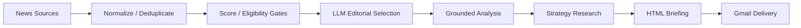

# 48-Hour Market Intelligence

An AI-powered market-intelligence pipeline that collects, filters, analyzes, and distributes source-grounded business news briefings.

## What it does

The briefing organizes decision-relevant developments into four modules:

1. **AI** — major model and product launches, compute infrastructure, semiconductors, investment, regulation, adoption, and competitive moves.
2. **Macro / Rates / FX** — central banks, inflation, labor data, rates, bonds, currencies, fiscal policy, and major economic releases.
3. **U.S. Healthcare Equities** — material developments affecting U.S.-listed healthcare companies, including FDA actions, trials, earnings, M&A, reimbursement, patents, and litigation.
4. **Corporate Strategy Case** — a structured, web-grounded case covering the situation, strategic problem, options, decision, execution, result, and transferable lessons.

## Why I built it

Financial information is abundant, but decision-useful context is fragmented across feeds, official releases, and publishers. This project turns that fragmented input into a compact briefing while preserving the source links and evidence behind each conclusion.

## Architecture



Live collection uses public metadata from RSS, GDELT, official central-bank sources, and FDA endpoints. The LLM stage is opt-in: it receives bounded, structured candidate evidence, selects eligible events, and produces analysis tied back to the collected sources. Corporate-strategy research is a separate bounded workflow using OpenAI web search.

## Key engineering decisions

- **Short, program-owned article IDs** keep model references stable without allowing the model to redefine source identity.
- **Python-owned source registries** map editorial and strategy claims back to known evidence and canonical URLs.
- **Source URL integrity** is validated before model output is accepted or rendered.
- **One event, one slot** deduplication clusters overlapping coverage while retaining alternate publishers and links.
- **Fail-closed U.S. healthcare eligibility** excludes unclear, promotional, lifestyle, and non-material candidates rather than assuming public-equity relevance.
- **Structured corporate-strategy research** uses a fixed analytical schema, bounded sourcing, identity locking, and region controls.
- **SMTP delivery** uses STARTTLS by default, with SSL available for providers that require it.
- **Manual recipient controls** support a validated one-run override without modifying the saved default.

## Example output

Open the [sanitized sample briefing](docs/sample_briefing.html). It is generated from the repository's fictional offline fixtures, uses only `example.com` links, and contains no live account, recipient, or credential data. It demonstrates the HTML structure rather than claiming current news analysis.

## Reliability

The current offline test suite contains **61 passing tests**. It covers normalization and event deduplication, scoring and selection, source and URL integrity, LLM structured-output validation, strategy-case controls, mocked live-source failure handling, SMTP configuration, recipient validation, sanitized delivery diagnostics, and command-line delivery routing. External news endpoints, OpenAI calls, and SMTP delivery are intentionally mocked in tests, so live availability still depends on those services.

Collectors use bounded timeouts, a modest retry, and endpoint-level isolation. A single source failure does not abort collection, and diagnostics record candidate and source outcomes without storing credentials.

## Tech stack

- Python 3.11+
- OpenAI Responses API
- GitHub Actions
- HTML/CSS
- SMTP / Gmail
- RSS, GDELT, openFDA, and official central-bank sources

## Current status

- On-demand offline or live briefing generation is available.
- Opt-in OpenAI editorial analysis and corporate-strategy research are implemented.
- SMTP email delivery works and requires an explicit send command.
- A validated `--email-to` recipient override is supported.
- The GitHub Actions delivery workflow is manual-only (`workflow_dispatch`).
- Automatic 48-hour scheduling is intentionally **not enabled**.

## Running locally

```bash
python -m venv .venv
source .venv/bin/activate
python -m pip install -r requirements.txt
python -m pytest

# Offline demonstration; no network or credentials required
python main.py

# Public-source collection
python main.py --live

# Public-source collection, grounded LLM analysis, and strategy case
python main.py --live --llm

# Explicitly send the newly generated LLM briefing
python main.py --live --llm --send-email
```

For a one-run recipient override, append `--email-to "reviewer@example.com"`. To send an existing generated briefing without rerunning collection, use `python main.py --email-existing-briefing`. Email is never sent by the ordinary offline, `--live`, or `--live --llm` commands.

Copy `.env.example` to `.env` for local configuration. Set only the variables needed by the command you run:

| Purpose | Environment variables |
| --- | --- |
| OpenAI | `OPENAI_API_KEY`, optionally `OPENAI_MODEL` |
| SMTP account | `SMTP_HOST`, `SMTP_PORT`, `SMTP_USERNAME`, `SMTP_PASSWORD` |
| Sender and recipients | `EMAIL_FROM`, `EMAIL_TO`, optionally `EMAIL_FROM_NAME` |
| SMTP transport | optionally `SMTP_USE_STARTTLS`, `SMTP_USE_SSL`, `SMTP_TIMEOUT` |

Do not commit `.env`. In GitHub Actions, configure credential values as repository or environment **Secrets**; the saved default recipient may be the `EMAIL_TO` Actions variable or secret.

## Repository map

```text
.github/workflows/        Manual validation and delivery workflow
config/                   Briefing preferences and publisher-quality rules
docs/                     Sanitized public portfolio sample
src/collectors/           RSS, GDELT, FDA, official-source, and mock collectors
src/deduplication/        Canonical URL and event-level duplicate handling
src/briefing/             Standalone escaped HTML rendering
src/email/                SMTP configuration, validation, and delivery
src/llm_editorial.py      Structured editorial selection and grounded analysis
src/strategy_case.py      Structured corporate-strategy research
main.py                   Command-line entry point and diagnostics
tests/                    Offline and mocked integration tests
data/output/              Local generated output; ignored except for `.gitkeep`
```

## Security

API keys and SMTP credentials are read from environment variables locally and from GitHub Secrets in the manual workflow; they are not repository configuration values. The workflow does not echo credentials, has read-only repository permissions, and passes secrets only to the steps that need them. Delivery diagnostics contain status, recipient count, subject, file path, and a sanitized error category—not addresses or passwords.

Fetched content is treated as untrusted display data: rendering escapes it, XML parsing does not execute it, and source evidence remains separate from instructions. The collectors do not scrape article bodies or bypass paywalls, authentication, CAPTCHAs, or robots controls.

Generated briefings, candidate payloads, model outputs, strategy history, delivery diagnostics, logs, and local environment files are ignored by default. Review any intentionally added portfolio artifact for source licensing, personal data, and credentials before committing it.
